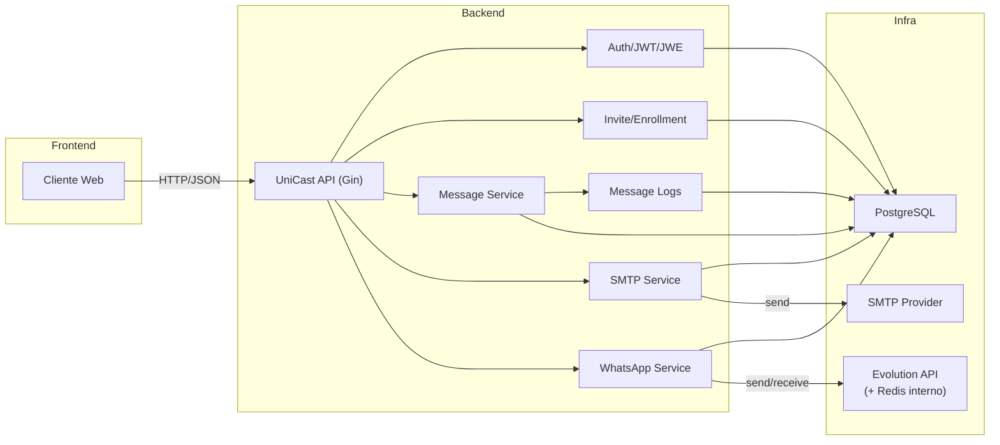
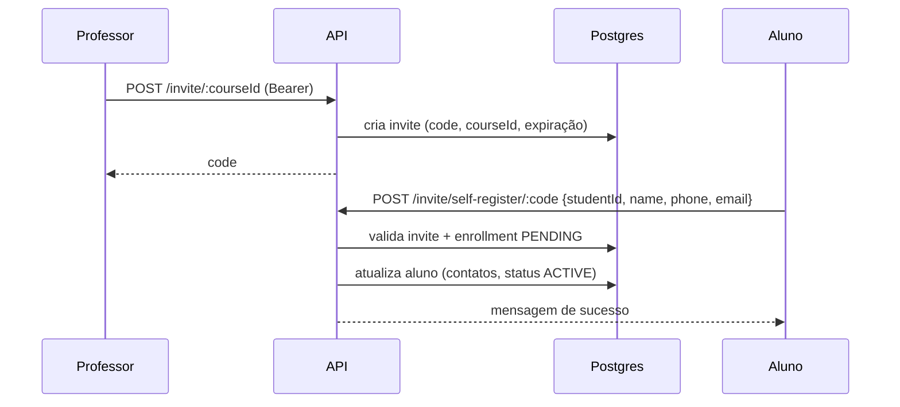
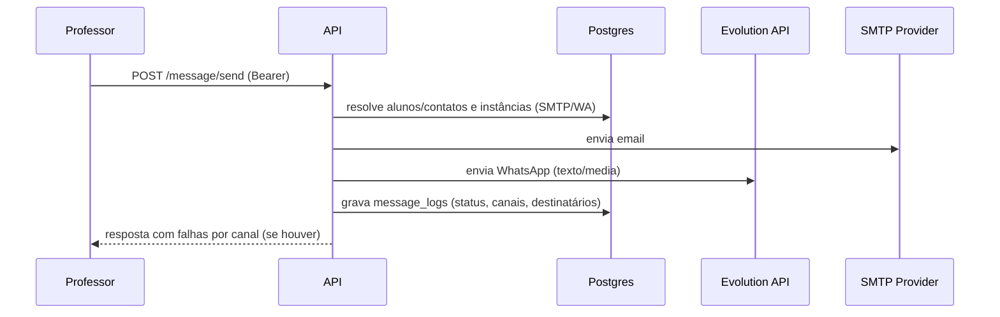
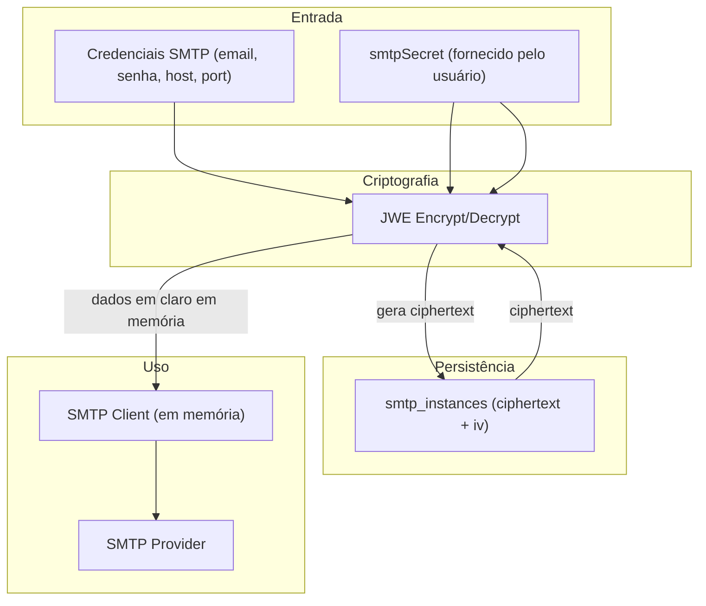
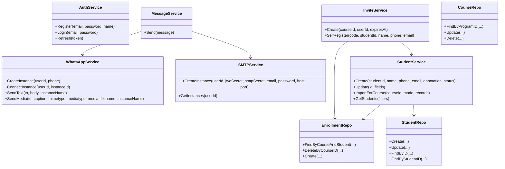
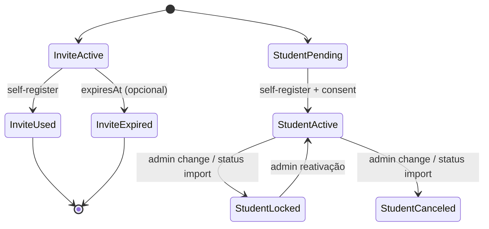
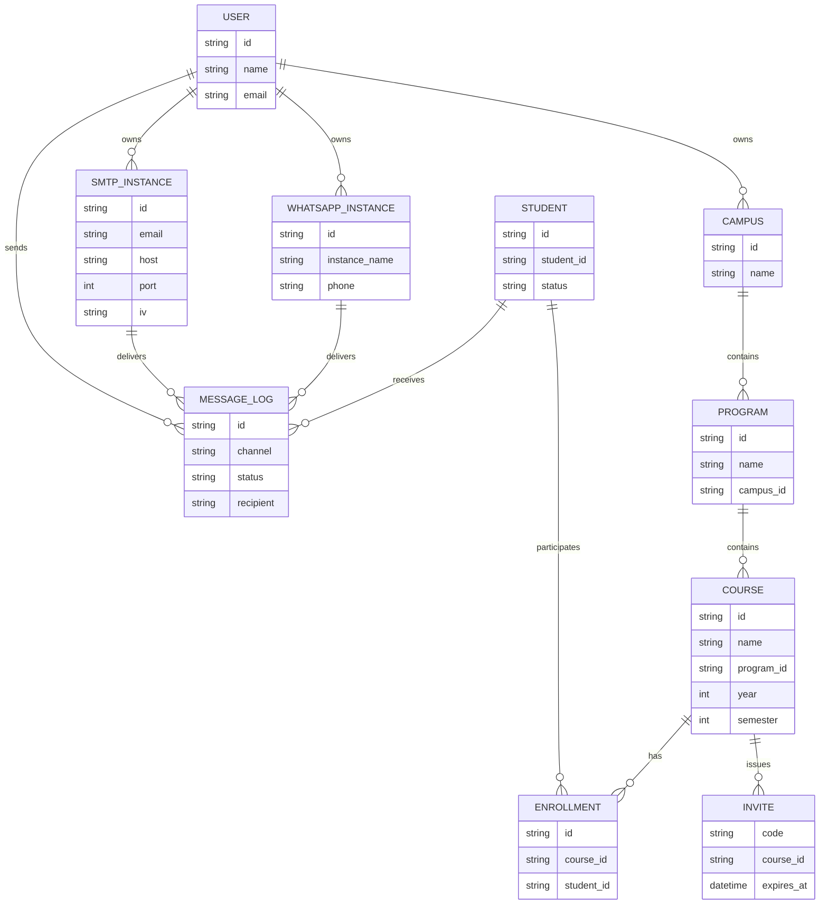
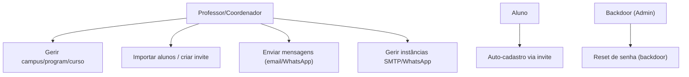

## Unicast

Backend em Go para fortalecer a comunicação docente–discente. Permite ao professor cadastrar disciplinas e alunos (pré-cadastrados por matrícula) e enviar mensagens que chegam por múltiplos canais (WhatsApp e e-mail), reduzindo o risco de a informação passar despercebida. Inclui autenticação, gestão de campus/curso/disciplina, convites públicos com código curto para o auto-cadastro do aluno, e integrações de SMTP e WhatsApp.

### Stack
- Go 1.24.x (Gin, Swagger, JWT/JWE, PQ)
- PostgreSQL (persistência principal)
- Redis + Evolution API (para WhatsApp)
- Docker Compose para ambiente local (postgres, redis, mongo, evolution, pgadmin)

### Estrutura (resumo)
- `cmd/main/main.go`: inicialização, DI dos repositórios/serviços e rotas.
- `internal/*`: módulos de domínio (auth, campus, program, course, student, enrollment, invite, smtp, whatsapp, user).
- `pkg/database`: abstrações de transação e helpers SQL.
- `migrations/`: migrações SQL (Postgres).
- `docs/`: documentação Swagger gerada pelo `swag`.

### Pré-requisitos
- Go 1.24.x instalado.
- `swag` CLI para gerar Swagger: `go install github.com/swaggo/swag/cmd/swag@latest`.
- (Opcional, hot reload) `air`: `go install github.com/air-verse/air@latest`.
- Docker e Docker Compose se for subir os serviços auxiliares.

### Configuração de ambiente
Crie um `.env` (ou `.env.development`) na raiz seguindo o `example.env`

> Dica: converta o `.env` para formato Unix se estiver no WSL: `dos2unix .env`.

### Subir dependências com Docker Compose (dev)
```
docker-compose -f docker-compose-dev.yaml up -d
```
Sobe Postgres, Redis, Evolution API, Mongo e PgAdmin com base nas variáveis do `.env`.

### Rodando a API
Opção 1) Script padrão (gera Swagger e executa):
```
./run.sh
```

Opção 2) Hot reload com Air (carrega .env/.env.development):
```
air
```
Swagger disponível em `http://localhost:${API_PORT}/swagger/index.html`.

### Fluxos principais
- **Auth**: `/auth/register`, `/auth/login`, `/auth/refresh`, `/auth/logout` (Bearer).
- **Campus/Program/Course**: CRUD protegido; ownership validado por usuário.
- **Students**: pré-cadastro com status (PENDING, ACTIVE, etc.).
- **Enrollments**: vínculo aluno ↔ disciplina.
- **Invites**: professor cria código curto para a disciplina (`POST /invite/:courseId`); aluno usa `POST /invite/self-register/:code` com `studentId`, `name`, `phone`, `email`. Backend valida vínculo (enrollment) e status `PENDING` antes de ativar.
- **Importação de alunos**: `POST /course/:courseId/students/import?mode=upsert|clean` (CSV multipart em `file`). Colunas aceitas: `studentId` (obrigatória), `name`, `phone`, `email`, `status` (1/2/3/4/5 ou ACTIVE/LOCKED/GRADUATED/CANCELED/PENDING). `mode=clean` remove matrículas do curso antes de inserir. Regras: se o aluno não existir, apenas o `studentId` é salvo com status `PENDING`; status pode ser atualizado sempre; dados de contato só são atualizados se o aluno já tiver algum contato salvo (cadastro próprio); contatos enviados para quem nunca se cadastrou são ignorados e logados.
- **SMTP/WhatsApp**: criação/listagem de instâncias de envio.
- **WhatsApp Instâncias**: além do CRUD de instâncias, expõe connect/status/logout/restart; criação já retorna QR/pairing code para parear.
- **Mensagens**: `POST /message/send` envia e-mail e WhatsApp para alunos; logs de entrega ficam em `message_logs`.
- **Backdoor admin**: `POST /backdoor/reset-password` com `ADMIN_SECRET` permite reset de senha por `userId` ou `email` para recuperar acesso.

### Segurança e credenciais
- **Tokens**: JWT para acesso/refresh; JWE com chave de 32 bytes hex para proteger tokens sensíveis.
- **SMTP**: credenciais armazenadas com criptografia (ver `internal/encryption` / `smtp`), usando `JWE_SECRET` para cifrar dados sensíveis antes de persistir.
- **Env vars**: segredos ficam no `.env`/`.env.development`. Não commitá-los; use `example.env` como base.
- **Ownership**: operações sensíveis (campus/program/course/invite) conferem o `userID` do token ao dono do recurso.
- **Invite codes**: códigos curtos únicos por disciplina; validados como ativos/não expirados e vinculados ao enrollment, garantindo que apenas alunos pré-cadastrados possam ativar seus dados.
- **Backdoor**: rota administrativa protegida por `ADMIN_SECRET`; trate essa chave como segredo crítico.
  
#### Modelo de criptografia SMTP
- Cada instância SMTP é criada pelo usuário fornecendo um segredo (`smtpSecret`) próprio; esse segredo não é armazenado em texto plano.
- As credenciais SMTP (email, senha, host/porta, IV) são cifradas com JWE usando o `smtpSecret` do usuário, de modo que um vazamento de banco afeta apenas a instância/usuário que teve o segredo comprometido.
- O `JWE_SECRET` global serve apenas para proteger dados sensíveis de tokens/JWE do sistema; o segredo específico de SMTP é fornecido pelo usuário, reduzindo o blast radius.
- Logs não carregam dados sensíveis; recomenda-se nunca registrar host/usuário/senha do SMTP em claro.

### Diagramas (Mermaid)

**Arquitetura geral**


**Fluxo de auto-cadastro via invite**


**Fluxo de envio de mensagem**


**Criptografia de credenciais SMTP**


**Diagrama de classes/serviços (alto nível)**


**Estados de Invite e Student (simplificado)**


**Entidades principais (ER simplificado)**


**Atores e fluxos principais**


### Migrations
Arquivo SQL em `migrations/`. Exemplo com golang-migrate:
```
migrate -path migrations -database "$POSTGRES_DATABASE_URL" up
```

### Referências úteis
- Swagger gerado em `docs/` (origem: `cmd/main/main.go` via `swag init`).
- Banco: migrations incluem `invites`, `enrollments`, `students`, `courses`, `programs`, `campuses`, `users`, `smtp_instances`, `whatsapp_instances`.

### Fluxo de uso rápido
1. Preencha `.env`/`.env.development` conforme `example.env`.
2. `docker-compose -f docker-compose-dev.yaml up -d` para dependências (Postgres, Redis, Evolution, Mongo, PgAdmin).
3. `./run.sh` ou `air` (hot reload) para subir a API.
4. Gere/swagger se precisar: `swag init -g cmd/main/main.go` (ou use o gerado em `docs/`).
5. Use `/auth/register` e `/auth/login` para obter tokens e chamar os demais endpoints protegidos (Bearer).
6. Cadastre campus/program/course; crie instâncias de SMTP/WhatsApp; crie invites para disciplinas; importe matrículas por curso se quiser (`/course/:courseId/students/import`); alunos finalizam o cadastro via invite `POST /invite/self-register/:code`.

### To-do / Roadmap
- Verifique o board no [Notion](https://www.notion.so/1c702239900d80b7b24dc911e23ed2a4?v=1c702239900d8012923e000c184e26af).
