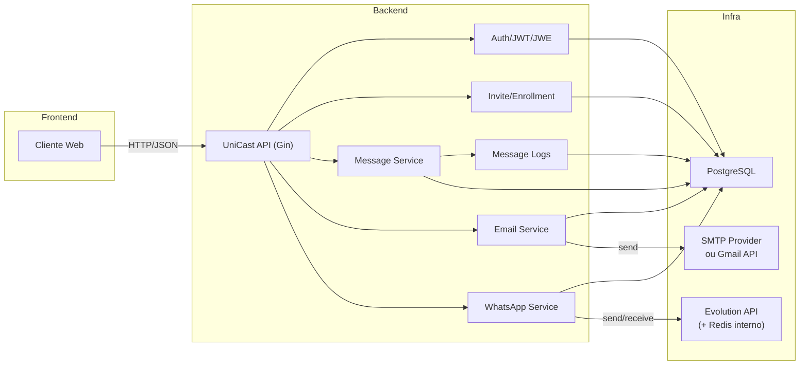
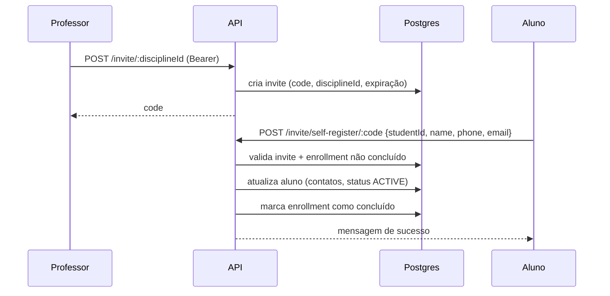
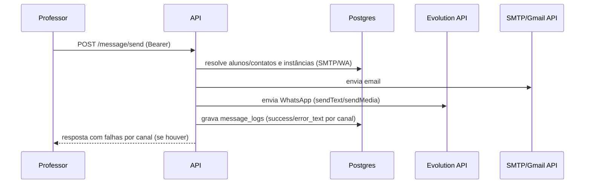
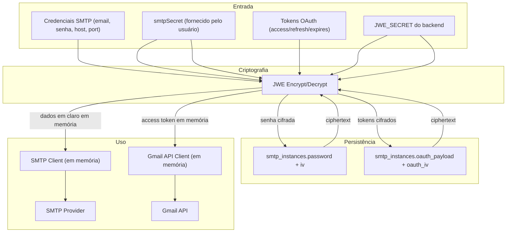
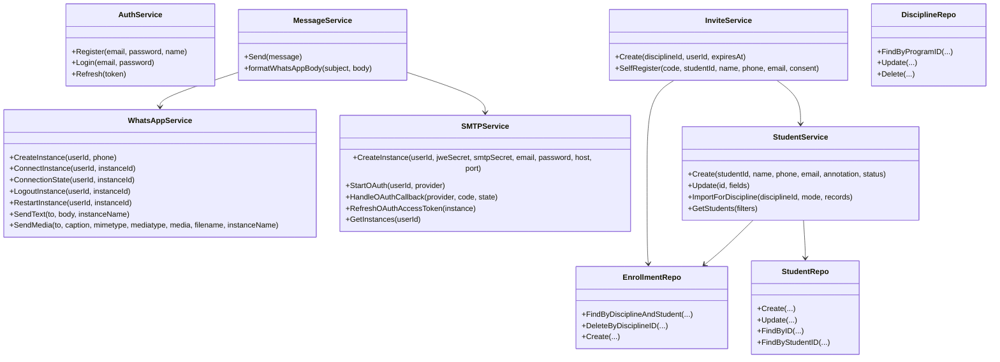
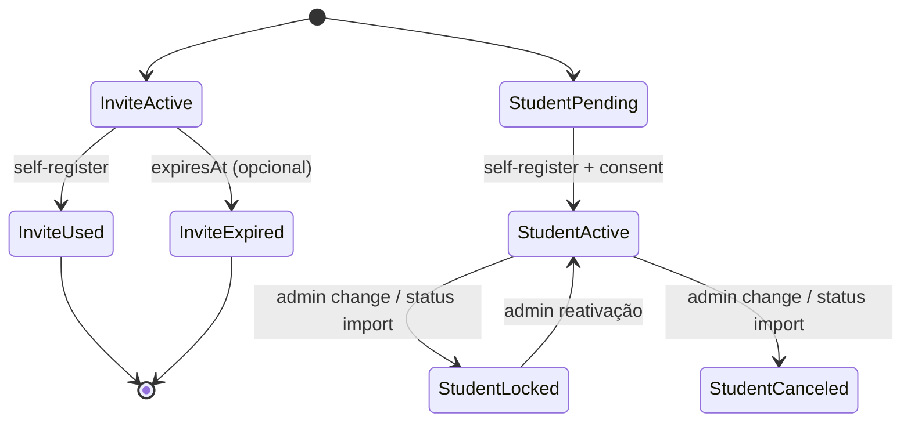
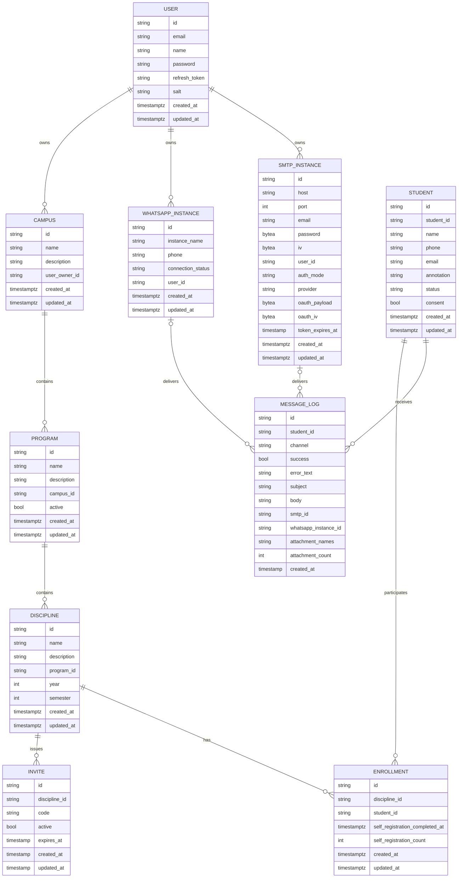
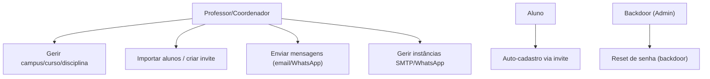

## Unicast

Backend em Go para fortalecer a comunicação docente–discente. Permite ao professor cadastrar disciplinas e alunos (pré-cadastrados por matrícula) e enviar mensagens que chegam por múltiplos canais (WhatsApp e e-mail), reduzindo o risco de a informação passar despercebida. Inclui autenticação, gestão de campus/curso/disciplina, convites públicos com código curto para o auto-cadastro do aluno, e integrações de Email e WhatsApp.

### Stack
- Go 1.24.x (Gin, Swagger, JWT/JWE, PQ)
- PostgreSQL (persistência principal)
- Redis + Evolution API (para WhatsApp)
- Docker Compose para ambiente local (postgres, redis, mongo, evolution, pgadmin)

### Estrutura (resumo)
- `cmd/main/main.go`: inicialização, DI dos repositórios/serviços e rotas.
- `internal/*`: módulos de domínio (auth, campus, program, discipline, student, enrollment, invite, message, smtp, whatsapp, user).
- `pkg/database`: abstrações de transação e helpers SQL.
- `migrations/`: migrações SQL (Postgres).
- `docs/`: documentação Swagger gerada pelo `swag` e guias operacionais manuais.

### Pré-requisitos
- Go 1.24.x instalado.
- `swag` CLI para gerar Swagger: `go install github.com/swaggo/swag/cmd/swag@latest`.
- (Opcional, hot reload) `air`: `go install github.com/air-verse/air@latest`.
- Docker e Docker Compose se for subir os serviços auxiliares.

### Configuração de ambiente
Crie um `.env` (ou `.env.development`) na raiz seguindo o `example.env`

> Dica: converta o `.env` para formato Unix se estiver no WSL: `dos2unix .env`.

### Subir dependências com Docker Compose (dev)
```
docker-compose -f docker-compose-dev.yaml up -d
```
Sobe Postgres, Redis, Evolution API, Mongo e PgAdmin com base nas variáveis do `.env`.

### Rodando a API
Opção 1) Script padrão (gera Swagger e executa):
```
./run.sh
```

Opção 2) Hot reload com Air (carrega .env/.env.development):
```
air
```
Swagger disponível em `http://localhost:${API_PORT}/swagger/index.html`.

### Seed de demonstração
Para apresentações do TCC, existe uma seed idempotente em `scripts/demo-seed.sql`.
Ela cria um usuário docente, campus, cursos, disciplinas, alunos, vínculos, convites e alguns logs de mensagem.

Credenciais do usuário demo:
```
email: demo@unicast.local
senha: Unicast@2026
```

Com `psql` local:
```
psql "$POSTGRES_DATABASE_URL" -f scripts/demo-seed.sql
```

Com o comando Go, sem depender do `psql` local:
```
go run ./cmd/seed
```

Com Makefile:
```
make seed
```

Se o `.env` usa `POSTGRES_HOST=postgres-unicast` para Docker, rode a seed a partir do host/WSL com:
```
make seed-local
```

Opcionalmente, informe arquivos específicos:
```
go run ./cmd/seed --env .env.development --file scripts/demo-seed.sql
```

O Makefile também aceita sobrescrita:
```
make seed-local ENV_FILE=.env.development POSTGRES_PORT_OVERRIDE=5433
```

Com o Postgres do Docker Compose:
```
docker exec -i postgres-unicast psql -U "$POSTGRES_USER" -d unicast < scripts/demo-seed.sql
```

Observação: a seed remove e recria apenas o usuário `demo@unicast.local` e as matrículas demo (`2026001` a `2026008`).

### Fluxos principais
- **Auth**: `/auth/register`, `/auth/login`, `/auth/refresh`, `/auth/logout` (Bearer).
- **Campus/Program/Discipline**: CRUD protegido; ownership validado por usuário. No produto: `program` = curso e `discipline` = disciplina/oferta.
- **Students**: pré-cadastro com status (PENDING, ACTIVE, etc.).
- **Enrollments**: vínculo aluno ↔ disciplina.
- **Invites**: professor cria código curto para a disciplina (`POST /invite/:disciplineId`); aluno usa `POST /invite/self-register/:code` com `studentId`, `name`, `phone`, `email`. Backend valida o vínculo (`enrollment`), permite uma conclusão de auto-cadastro por vínculo da disciplina e ativa o aluno ao concluir.
- **Importação de alunos**: `POST /discipline/:disciplineId/students/import?mode=upsert|clean` (CSV multipart em `file`). Colunas aceitas: `studentId` (obrigatória), `name`, `phone`, `email`, `status` (1/2/3/4/5 ou ACTIVE/LOCKED/GRADUATED/CANCELED/PENDING). `mode=clean` remove matrículas da disciplina antes de inserir. Regras: se o aluno não existir, apenas o `studentId` é salvo com status `PENDING`; status pode ser atualizado sempre; dados de contato só são atualizados se o aluno já tiver algum contato salvo (cadastro próprio); contatos enviados para quem nunca se cadastrou são ignorados e logados.
- **Email**: criação/listagem de instâncias de envio por senha SMTP ou OAuth.
- **OAuth de Email**: para Gmail/Google via Gmail API, veja `docs/oauth-email-setup.md`.
- **WhatsApp Instâncias**: além do CRUD de instâncias, expõe connect/status/logout/restart; criação já retorna QR/pairing code para parear via Evolution API.
- **Mensagens**: `POST /message/send` envia e-mail e WhatsApp para alunos; aceita anexos em base64 ou URL; logs de entrega ficam em `message_logs`.
- **Backdoor admin**: `POST /backdoor/reset-password` com `ADMIN_SECRET` permite reset de senha por `userId` ou `email` para recuperar acesso.

#### Envio de mensagens
- O endpoint principal é `POST /message/send`.
- É necessário informar pelo menos um canal: `smtp_id`, `whatsapp_id`, ou ambos.
- `to` recebe os IDs internos dos alunos.
- `subject` é usado como assunto no e-mail e como título em negrito no WhatsApp: `*Assunto*`, seguido de uma linha em branco e do corpo.
- `body` é o corpo enviado por e-mail e WhatsApp.
- `attachments` aceita itens com `fileName` e `data` em base64, ou `fileName` e `url`.
- No WhatsApp, anexos são enviados pela Evolution como `image`, `video`, `audio` ou `document`, conforme o MIME/extensão do arquivo.
- Para detalhes do contrato WhatsApp/Evolution, veja `docs/whatsapp-evolution.md`.

Exemplo:

```json
{
  "smtp_id": "uuid-da-instancia-smtp",
  "whatsapp_id": "uuid-da-instancia-whatsapp",
  "subject": "Aviso importante",
  "body": "A aula foi remarcada para sexta-feira.",
  "to": ["uuid-do-aluno"],
  "attachments": [
    {
      "fileName": "comunicado.pdf",
      "data": "JVBERi0xLjcK..."
    }
  ]
}
```

### Segurança e credenciais
- **Tokens**: JWT para acesso/refresh; JWE com chave de 32 bytes hex para proteger tokens sensíveis.
- **Email**: credenciais de senha SMTP são cifradas com segredo fornecido pelo usuário; tokens OAuth ficam cifrados com o segredo global do backend.
- **Env vars**: segredos ficam no `.env`/`.env.development`. Não commitá-los; use `example.env` como base.
- **Ownership**: operações sensíveis (campus/program/discipline/invite) conferem o `userID` do token ao dono do recurso.
- **Invite codes**: códigos curtos únicos por disciplina; validados como ativos/não expirados e vinculados ao enrollment, garantindo que apenas alunos pré-cadastrados possam ativar seus dados. O auto-cadastro é bloqueado depois da primeira conclusão naquele enrollment, sem impedir novos vínculos do mesmo aluno em outras disciplinas/ofertas.
- **Backdoor**: rota administrativa protegida por `ADMIN_SECRET`; trate essa chave como segredo crítico.
  
#### Modelo de criptografia SMTP
- Cada instância SMTP é criada pelo usuário fornecendo um segredo (`smtpSecret`) próprio; esse segredo não é armazenado em texto plano.
- As credenciais SMTP (email, senha, host/porta, IV) são cifradas com JWE usando o `smtpSecret` do usuário, de modo que um vazamento de banco afeta apenas a instância/usuário que teve o segredo comprometido.
- O `JWE_SECRET` global serve apenas para proteger dados sensíveis de tokens/JWE do sistema; o segredo específico de SMTP é fornecido pelo usuário, reduzindo o blast radius.
- Logs não carregam dados sensíveis; recomenda-se nunca registrar host/usuário/senha do SMTP em claro.

### Diagramas (Mermaid)

**Arquitetura geral**

```mermaid
flowchart LR
    subgraph Frontend
        FE["Cliente Web"]
    end
    subgraph Backend
        API["UniCast API (Gin)"]
        Auth["Auth/JWT/JWE"]
        Msg["Message Service"]
        Inv["Invite/Enrollment"]
        SMTP["Email Service"]
        WA["WhatsApp Service"]
        Log["Message Logs"]
    end
    subgraph Infra
        PG["PostgreSQL"]
        Evo["Evolution API\n(+ Redis interno)"]
        Mail["SMTP Provider\nou Gmail API"]
    end

    FE -->|HTTP/JSON| API
    API --> Auth
    API --> Inv
    API --> Msg
    API --> SMTP
    API --> WA
    Msg --> Log
    Auth --> PG
    Inv --> PG
    Msg --> PG
    Log --> PG
    SMTP --> PG
    WA --> PG
    WA -->|send/receive| Evo
    SMTP -->|send| Mail
```

**Fluxo de auto-cadastro via invite**

```mermaid
sequenceDiagram
    participant Professor
    participant API
    participant DB as Postgres
    participant Aluno

    Professor->>API: POST /invite/:disciplineId (Bearer)
    API->>DB: cria invite (code, disciplineId, expiração)
    API-->>Professor: code
    Aluno->>API: POST /invite/self-register/:code {studentId, name, phone, email}
    API->>DB: valida invite + enrollment não concluído
    API->>DB: atualiza aluno (contatos, status ACTIVE)
    API->>DB: marca enrollment como concluído
    API-->>Aluno: mensagem de sucesso
```

**Fluxo de envio de mensagem**

```mermaid
sequenceDiagram
    participant Professor
    participant API
    participant DB as Postgres
    participant Evo as Evolution API
    participant Mail as SMTP/Gmail API

    Professor->>API: POST /message/send (Bearer)
    API->>DB: resolve alunos/contatos e instâncias (SMTP/WA)
    API->>Mail: envia email
    API->>Evo: envia WhatsApp (sendText/sendMedia)
    API->>DB: grava message_logs (success/error_text por canal)
    API-->>Professor: resposta com falhas por canal (se houver)
```

**Criptografia de credenciais de email**

```mermaid
flowchart TD
    subgraph Entrada
      SmtpSecret["smtpSecret (fornecido pelo usuário)"]
      Creds["Credenciais SMTP (email, senha, host, port)"]
      OAuthTokens["Tokens OAuth (access/refresh/expires)"]
      JWESecret["JWE_SECRET do backend"]
    end

    subgraph Criptografia
      JWE["JWE Encrypt/Decrypt"]
    end

    subgraph Persistência
      DBPassword["smtp_instances.password + iv"]
      DBOAuth["smtp_instances.oauth_payload + oauth_iv"]
    end

    subgraph Uso
      SMTPClient["SMTP Client (em memória)"]
      GmailClient["Gmail API Client (em memória)"]
      Mail["SMTP Provider"]
      Gmail["Gmail API"]
    end

    Creds --> JWE
    SmtpSecret --> JWE
    JWE -->|senha cifrada| DBPassword
    DBPassword -->|ciphertext| JWE
    SmtpSecret --> JWE
    JWE -->|dados em claro em memória| SMTPClient
    SMTPClient --> Mail

    OAuthTokens --> JWE
    JWESecret --> JWE
    JWE -->|tokens cifrados| DBOAuth
    DBOAuth -->|ciphertext| JWE
    JWESecret --> JWE
    JWE -->|access token em memória| GmailClient
    GmailClient --> Gmail
```

**Diagrama de classes/serviços (alto nível)**

```mermaid
classDiagram
    class AuthService {
      +Register(email, password, name)
      +Login(email, password)
      +Refresh(token)
    }
    class InviteService {
      +Create(disciplineId, userId, expiresAt)
      +SelfRegister(code, studentId, name, phone, email, consent)
    }
    class MessageService {
      +Send(message)
      +formatWhatsAppBody(subject, body)
    }
    class WhatsAppService {
      +CreateInstance(userId, phone)
      +ConnectInstance(userId, instanceId)
      +ConnectionState(userId, instanceId)
      +LogoutInstance(userId, instanceId)
      +RestartInstance(userId, instanceId)
      +SendText(to, body, instanceName)
      +SendMedia(to, caption, mimetype, mediatype, media, filename, instanceName)
    }
    class SMTPService {
      +CreateInstance(userId, jweSecret, smtpSecret, email, password, host, port)
      +StartOAuth(userId, provider)
      +HandleOAuthCallback(provider, code, state)
      +RefreshOAuthAccessToken(instance)
      +GetInstances(userId)
    }
    class StudentService {
      +Create(studentId, name, phone, email, annotation, status)
      +Update(id, fields)
      +ImportForDiscipline(disciplineId, mode, records)
      +GetStudents(filters)
    }
    class EnrollmentRepo {
      +FindByDisciplineAndStudent(...)
      +DeleteByDisciplineID(...)
      +Create(...)
    }
    class StudentRepo {
      +Create(...)
      +Update(...)
      +FindByID(...)
      +FindByStudentID(...)
    }
    class DisciplineRepo {
      +FindByProgramID(...)
      +Update(...)
      +Delete(...)
    }

    MessageService --> WhatsAppService
    MessageService --> SMTPService
    InviteService --> EnrollmentRepo
    InviteService --> StudentService
    StudentService --> StudentRepo
    StudentService --> EnrollmentRepo
```

**Estados de Invite e Student (simplificado)**

```mermaid
stateDiagram-v2
    [*] --> InviteActive
    InviteActive --> InviteUsed: self-register
    InviteActive --> InviteExpired: expiresAt (opcional)
    InviteUsed --> [*]
    InviteExpired --> [*]

    [*] --> StudentPending
    StudentPending --> StudentActive: self-register + consent
    StudentActive --> StudentLocked: admin change / status import
    StudentActive --> StudentCanceled: admin change / status import
    StudentLocked --> StudentActive: admin reativação
```

**Entidades principais (ER atual)**

```mermaid
erDiagram
    USER ||--o{ CAMPUS : owns
    USER ||--o{ WHATSAPP_INSTANCE : owns
    USER ||--o{ SMTP_INSTANCE : owns

    CAMPUS ||--o{ PROGRAM : contains
    PROGRAM ||--o{ DISCIPLINE : contains
    DISCIPLINE ||--o{ INVITE : issues
    DISCIPLINE ||--o{ ENROLLMENT : has

    STUDENT ||--o{ ENROLLMENT : participates
    STUDENT ||--o{ MESSAGE_LOG : receives

    WHATSAPP_INSTANCE |o--o{ MESSAGE_LOG : delivers
    SMTP_INSTANCE |o--o{ MESSAGE_LOG : delivers

    USER {
        string id
        string email
        string name
        string password
        string refresh_token
        string salt
        timestamptz created_at
        timestamptz updated_at
    }
    CAMPUS {
        string id
        string name
        string description
        string user_owner_id
        timestamptz created_at
        timestamptz updated_at
    }
    PROGRAM {
        string id
        string name
        string description
        string campus_id
        bool active
        timestamptz created_at
        timestamptz updated_at
    }
    DISCIPLINE {
        string id
        string name
        string description
        string program_id
        int year
        int semester
        timestamptz created_at
        timestamptz updated_at
    }
    STUDENT {
        string id
        string student_id
        string name
        string phone
        string email
        string annotation
        string status
        bool consent
        timestamptz created_at
        timestamptz updated_at
    }
    ENROLLMENT {
        string id
        string discipline_id
        string student_id
        timestamptz self_registration_completed_at
        int self_registration_count
        timestamptz created_at
        timestamptz updated_at
    }
    INVITE {
        string id
        string discipline_id
        string code
        bool active
        timestamp expires_at
        timestamp created_at
        timestamp updated_at
    }
    WHATSAPP_INSTANCE {
        string id
        string instance_name
        string phone
        string connection_status
        string user_id
        timestamptz created_at
        timestamptz updated_at
    }
    SMTP_INSTANCE {
        string id
        string host
        int port
        string email
        bytea password
        bytea iv
        string user_id
        string auth_mode
        string provider
        bytea oauth_payload
        bytea oauth_iv
        timestamp token_expires_at
        timestamptz created_at
        timestamptz updated_at
    }
    MESSAGE_LOG {
        string id
        string student_id
        string channel
        bool success
        string error_text
        string subject
        string body
        string smtp_id
        string whatsapp_instance_id
        string attachment_names
        int attachment_count
        timestamp created_at
    }
```

**Atores e fluxos principais**

```mermaid
flowchart TB
    Professor["Professor/Coordenador"]
    Aluno["Aluno"]
    Admin["Backdoor (Admin)"]

    C1["Gerir campus/curso/disciplina"]
    C2["Importar alunos / criar invite"]
    C3["Auto-cadastro via invite"]
    C4["Enviar mensagens (email/WhatsApp)"]
    C5["Gerir instâncias SMTP/WhatsApp"]
    C6["Reset de senha (backdoor)"]

    Professor --> C1
    Professor --> C2
    Professor --> C4
    Professor --> C5
    Aluno --> C3
    Admin --> C6
```

### Migrations
Arquivo SQL em `migrations/`. Exemplo com golang-migrate:
```
migrate -path migrations -database "$POSTGRES_DATABASE_URL" up
```

### Referências úteis
- Swagger gerado em `docs/` (origem: `cmd/main/main.go` via `swag init -g cmd/main/main.go --parseInternal --parseDependency --parseDepth 1`).
- OAuth de email com Gmail: `docs/oauth-email-setup.md`.
- WhatsApp/Evolution: `docs/whatsapp-evolution.md`.
- Banco: migrations incluem `users`, `campuses`, `programs`, `disciplines`, `students`, `enrollments`, `invites`, `smtp_instances`, `whatsapp_instances` e `message_logs`. A migration `000021` renomeia `courses/course_id` para `disciplines/discipline_id`; a `000022` adiciona o controle de auto-cadastro concluído por enrollment.

### Fluxo de uso rápido
1. Preencha `.env`/`.env.development` conforme `example.env`.
2. `docker-compose -f docker-compose-dev.yaml up -d` para dependências (Postgres, Redis, Evolution, Mongo, PgAdmin).
3. `./run.sh` ou `air` (hot reload) para subir a API.
4. Gere o Swagger se precisar: `swag init -g cmd/main/main.go --parseInternal --parseDependency --parseDepth 1` (ou use o gerado em `docs/`).
5. Use `/auth/register` e `/auth/login` para obter tokens e chamar os demais endpoints protegidos (Bearer).
6. Cadastre campus/curso/disciplina; crie instâncias de Email/WhatsApp; crie invites para disciplinas; importe matrículas por disciplina se quiser (`/discipline/:disciplineId/students/import`); alunos finalizam o cadastro via invite `POST /invite/self-register/:code`.
7. Para testar envio, pareie uma instância WhatsApp, conecte uma conta de email por SMTP/OAuth se necessário, e use `POST /message/send` com `smtp_id`, `whatsapp_id`, ou ambos.

### To-do / Roadmap
- Verifique o board no [Notion](https://www.notion.so/1c702239900d80b7b24dc911e23ed2a4?v=1c702239900d8012923e000c184e26af).
