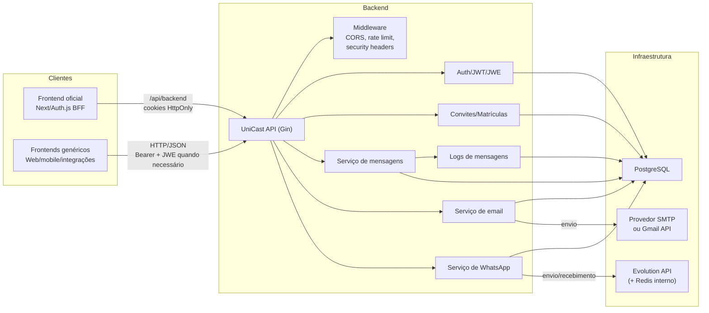
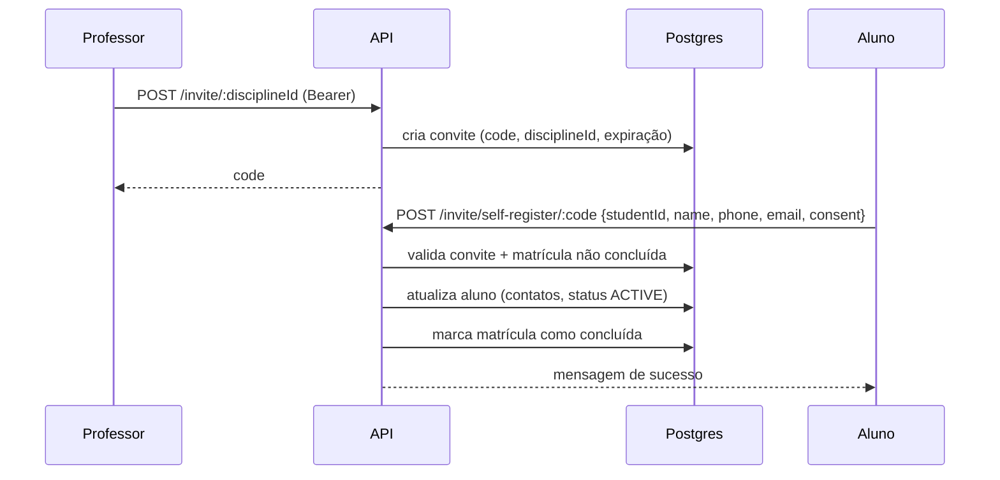
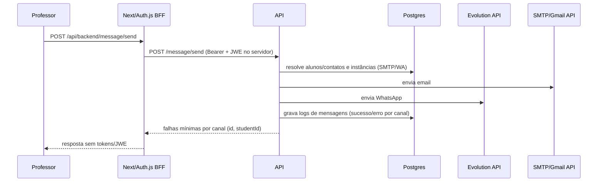
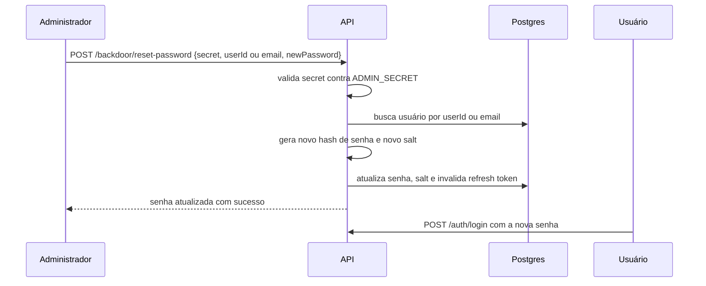
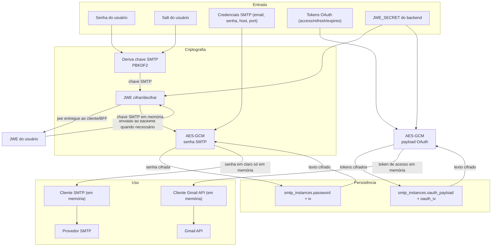
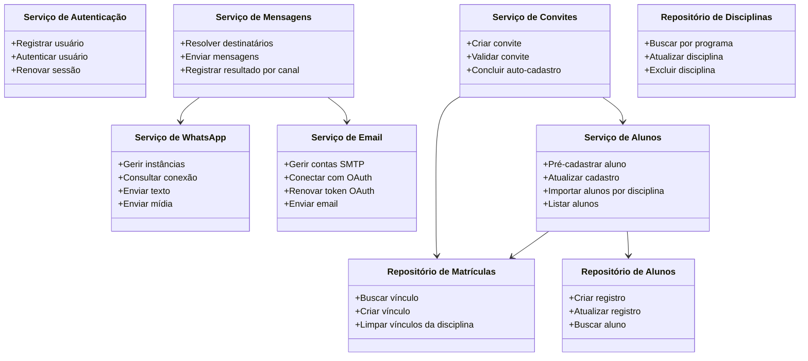
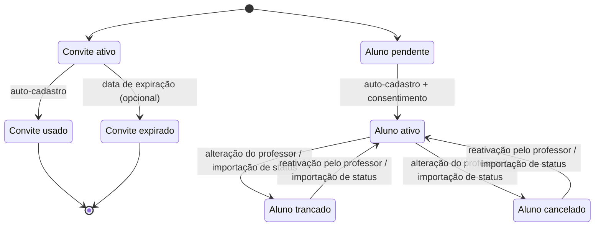
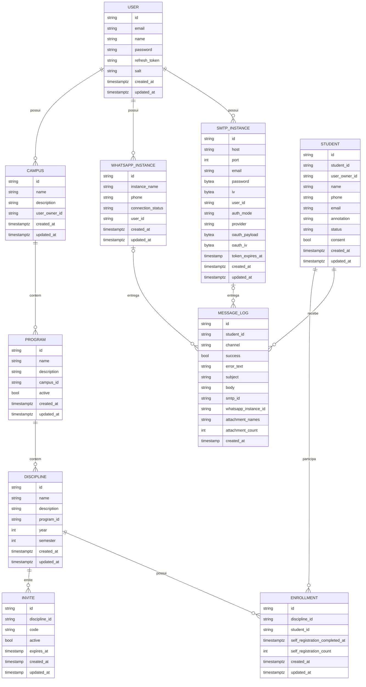
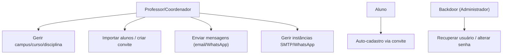

## Unicast

Backend em Go para fortalecer a comunicação docente–discente. Permite ao professor cadastrar disciplinas e alunos (pré-cadastrados por matrícula) e enviar mensagens que chegam por múltiplos canais (WhatsApp e e-mail), reduzindo o risco de a informação passar despercebida. Inclui autenticação, gestão de campus/curso/disciplina, convites públicos com código curto para o auto-cadastro do aluno, e integrações de Email e WhatsApp.

O backend foi desenhado como uma API reutilizável por diferentes clientes. O frontend oficial usa um BFF em Next/Auth.js para guardar `accessToken`, `refreshToken` e `jwe` em cookies `HttpOnly`, mas outros frontends podem consumir a API diretamente com Bearer token desde que armazenem esses artefatos com cuidado equivalente.

### Stack
- Go 1.24.x (Gin, Swagger, JWT/JWE, PQ)
- PostgreSQL (persistência principal)
- Redis + Evolution API (para WhatsApp)
- Docker Compose para ambiente local (postgres, redis, mongo, evolution, pgadmin)

### Estrutura (resumo)
- `cmd/main/main.go`: inicialização, DI dos repositórios/serviços e rotas.
- `internal/*`: módulos de domínio (auth, campus, program, discipline, student, enrollment, invite, message, smtp, whatsapp, user).
- `pkg/database`: abstrações de transação e helpers SQL.
- `migrations/`: migrações SQL (Postgres).
- `docs/`: documentação Swagger gerada pelo `swag` e guias operacionais manuais.

### Pré-requisitos
- Go 1.24.x instalado.
- `swag` CLI para gerar Swagger: `go install github.com/swaggo/swag/cmd/swag@latest`.
- (Opcional, hot reload) `air`: `go install github.com/air-verse/air@latest`.
- Docker e Docker Compose se for subir os serviços auxiliares.

### Configuração de ambiente
Crie um `.env` (ou `.env.development`) na raiz seguindo o `example.env`.

Variáveis importantes para o fluxo atual:
- `REGISTER_INVITE_KEY`: chave global exigida em `POST /auth/register` para restringir criação de contas.
- `ADMIN_SECRET`: chave administrativa do backdoor de recuperação de senha.
- `JWE_SECRET`: segredo global usado para cifrar o JWE e payloads OAuth.
- `POSTGRES_DATABASE_URL`: URL do Postgres; para tarefas locais via `mise`, as migrations montam a URL a partir de `POSTGRES_HOST`, `POSTGRES_PORT`, `POSTGRES_USER`, `POSTGRES_PASSWORD` e `POSTGRES_DB`.

> Dica: converta o `.env` para formato Unix se estiver no WSL: `dos2unix .env`.

### Fluxo operacional com mise
O padrão do projeto passa a ser o `mise`. Depois de instalar o `mise`, confie no projeto e instale as ferramentas declaradas:

```bash
mise trust
mise install
```

Principais comandos:

```bash
mise run free-port-dev
mise run compose-up-dev
mise run compose-down-dev
mise run migrate-dev
mise run bootstrap-dev

mise run free-port-prod
mise run compose-up-prod
mise run compose-down-prod
mise run migrate-prod
mise run bootstrap-prod
```

As tasks `bootstrap-dev` e `bootstrap-prod` executam o fluxo completo:
1. liberar a porta do Postgres configurado
2. subir o `docker compose` correspondente
3. aplicar as migrations

### Subir dependências com Docker Compose (dev)
```
mise run compose-up-dev
```
Sobe Postgres, Redis, Evolution API, Mongo e PgAdmin com base nas variáveis do `.env.development`.

### Rodando a API
Opção 1) Script padrão (gera Swagger e executa):
```
./run.sh
```

Opção 2) Hot reload com Air (carrega .env/.env.development):
```
air
```
Swagger disponível em `http://localhost:${API_PORT}/swagger/index.html`.

### Seed de demonstração
Para demonstrações e testes locais, existe uma seed idempotente em `scripts/demo-seed.sql`.
Ela cria um usuário docente, campus, cursos, disciplinas, alunos, vínculos, convites e alguns logs de mensagem.

Antes da seed, aplique as migrations com `mise run migrate-dev` ou `mise run migrate-prod`.

Credenciais do usuário demo:
```
email: demo@unicast.local
senha: Unicast@2026
```

Com `psql` local:
```
psql "$POSTGRES_DATABASE_URL" -f scripts/demo-seed.sql
```

Com o comando Go, sem depender do `psql` local:
```
go run ./cmd/seed
```

Com mise:
```
mise run seed
```

Se o `.env` usa `POSTGRES_HOST=postgres-unicast` para Docker, rode a seed a partir do host/WSL com:
```
mise run seed-local
```

Opcionalmente, informe arquivos específicos:
```
ENV_FILE=.env.development SEED_FILE=scripts/demo-seed.sql mise run seed
```

O `mise` também aceita sobrescrita:
```
ENV_FILE=.env.development POSTGRES_PORT_OVERRIDE=5433 mise run seed-local
```

Com o Postgres do Docker Compose:
```
docker exec -i postgres-unicast psql -U "$POSTGRES_USER" -d unicast < scripts/demo-seed.sql
```

Observação: a seed remove e recria apenas o usuário `demo@unicast.local` e a faixa de matrículas demo (`2026001` a `2026999`). Essa faixa inclui os alunos fixos da seed e os alunos importados pelo CSV de demonstração.

### Fluxos principais
- **Auth**: `/auth/register`, `/auth/login`, `/auth/refresh`, `/auth/logout` (Bearer). O registro exige `registrationKey`, validada contra `REGISTER_INVITE_KEY`.
- **Campus/Program/Discipline**: CRUD protegido; ownership validado por usuário. No produto: `program` = curso e `discipline` = disciplina/oferta.
- **Students**: pré-cadastro com status (PENDING, ACTIVE, etc.). Alunos agora são isolados por usuário dono (`user_owner_id`) e a unicidade funcional é `(user_owner_id, student_id)`.
- **Enrollments**: vínculo aluno ↔ disciplina. Como disciplina pertence a um usuário, os vínculos também ficam dentro do mesmo ambiente.
- **Invites**: professor cria código curto para a disciplina (`POST /invite/:disciplineId`); aluno usa `POST /invite/self-register/:code` com `studentId`, `name`, `phone`, `email`. Backend valida o vínculo (`enrollment`), permite uma conclusão de auto-cadastro por vínculo da disciplina e ativa o aluno ao concluir.
- **Importação de alunos**: `POST /discipline/:id/students/import?mode=upsert|clean` (CSV multipart em `file`). Colunas aceitas: `studentId` (obrigatória), `name`, `phone`, `email`, `status` (1/2/3/4/5 ou ACTIVE/LOCKED/GRADUATED/CANCELED/PENDING). Linhas com campos finais ausentes são aceitas; campos ausentes entram como vazios. `mode=clean` remove matrículas da disciplina antes de inserir. Se o aluno não existir no contexto do usuário dono da disciplina, é criado com os dados enviados e status derivado do contato/status informado. Se já existir para esse usuário, campos enviados atualizam o cadastro e o vínculo com a disciplina é garantido.
- **Email**: criação/listagem de instâncias de envio por senha SMTP ou OAuth.
- **OAuth de Email**: para Gmail/Google via Gmail API, veja `docs/oauth-email-setup.md`.
- **WhatsApp Instâncias**: além do CRUD de instâncias, expõe connect/status/logout/restart; criação já retorna QR/pairing code para parear via Evolution API.
- **Mensagens**: `POST /message/send` envia e-mail e WhatsApp para alunos; aceita anexos em base64 ou URL; logs de entrega ficam em `message_logs`. A resposta de falhas por canal retorna apenas `id` e `studentId` dos alunos afetados, evitando expor contato/anotações desnecessariamente.
- **Backdoor admin**: `POST /backdoor/reset-password` com `secret`, `newPassword` e `userId` ou `email`. O `secret` deve corresponder ao `ADMIN_SECRET`; a rota permite recuperar acesso ao alterar a senha e invalidar sessões existentes do usuário.

#### Envio de mensagens
- O endpoint principal é `POST /message/send`.
- É necessário informar pelo menos um canal: `smtp_id`, `whatsapp_id`, ou ambos.
- `to` recebe os IDs internos dos alunos.
- `subject` é usado como assunto no e-mail e como título em negrito no WhatsApp: `*Assunto*`, seguido de uma linha em branco e do corpo.
- `body` é o corpo enviado por e-mail e WhatsApp.
- `attachments` aceita itens com `fileName` e `data` em base64, ou `fileName` e `url`.
- E-mail por SMTP e OAuth usa anexos com `data` em base64 ou faz download do arquivo quando vier `url`.
- No WhatsApp, anexos são enviados pela Evolution como `image`, `video`, `audio` ou `document`, conforme o MIME/extensão do arquivo. O texto principal vai primeiro, e os anexos seguem sem legenda.
- Limites atuais: até `5` anexos, `10 MB` por arquivo, `25 MB` somando anexos do email e `15 MB` somando anexos enviados no payload do WhatsApp.
- Tipos perigosos como `exe`, `msi`, `bat`, `cmd`, `sh`, `ps1`, `apk`, `jar` e similares são bloqueados.
- Para detalhes do contrato WhatsApp/Evolution, veja `docs/whatsapp-evolution.md`.

Exemplo:

```json
{
  "smtp_id": "uuid-da-instancia-smtp",
  "whatsapp_id": "uuid-da-instancia-whatsapp",
  "subject": "Aviso importante",
  "body": "A aula foi remarcada para sexta-feira.",
  "to": ["uuid-do-aluno"],
  "attachments": [
    {
      "fileName": "comunicado.pdf",
      "data": "JVBERi0xLjcK..."
    }
  ]
}
```

Resposta de sucesso:

```json
{
  "message": "Mensagem enviada com sucesso",
  "data": {
    "emailsFailed": [
      { "id": "uuid-do-aluno", "studentId": "2026996" }
    ],
    "whatsappFailed": []
  }
}
```

### Segurança e credenciais
- **Tokens**: JWT para acesso/refresh; o backend também emite um JWE contendo a chave derivada do usuário para uso com credenciais SMTP. Esse JWE é cifrado com `JWE_SECRET`.
- **Frontend oficial**: usa BFF em Next/Auth.js. `accessToken`, `refreshToken` e `jwe` ficam em cookie/sessão `HttpOnly`; o BFF injeta Bearer token e `jwe` server-side quando chama a API.
- **Frontends genéricos**: podem usar os endpoints diretamente, mas devem tratar `accessToken`, `refreshToken` e `jwe` como credenciais sensíveis. Evite `localStorage` para sessões de produção; prefira BFF/cookies `HttpOnly`, armazenamento em memória com renovação controlada, proteção contra XSS e CSRF/Origin checks quando houver cookies.
- **Email**: senhas SMTP são cifradas com chave derivada da senha do usuário; essa chave derivada é transportada dentro do JWE. Tokens OAuth ficam cifrados com o segredo global do backend.
- **Env vars**: segredos ficam no `.env`/`.env.development`. Não commitá-los; use `example.env` como base.
- **Ownership**: operações sensíveis (campus/program/discipline/invite/student/message) conferem o `userID` do token ao dono do recurso ou ao contexto do recurso.
- **Registro fechado**: o cadastro de usuário usa uma chave global em `REGISTER_INVITE_KEY`; com isso o endpoint não fica aberto publicamente mesmo sem confirmação por email.
- **Invite codes**: códigos curtos únicos por disciplina; validados como ativos/não expirados e vinculados ao enrollment, garantindo que apenas alunos pré-cadastrados possam ativar seus dados. O auto-cadastro é bloqueado depois da primeira conclusão naquele enrollment, sem impedir novos vínculos do mesmo aluno em outras disciplinas/ofertas.
- **Backdoor**: rota administrativa protegida por `ADMIN_SECRET`; trate essa chave como segredo crítico.
- **Rate limit**: rotas sensíveis têm limite em memória por IP + rota. Ex.: login/register/refresh e auto-cadastro, backdoor, envio de mensagens e criação/teste/conexão de integrações.
- **Erros públicos**: respostas HTTP usam mensagens seguras; detalhes internos ficam nos logs do servidor.
- **Headers de segurança**: a API aplica `X-Content-Type-Options`, `X-Frame-Options`, `Referrer-Policy`, `Permissions-Policy`, `Cross-Origin-Opener-Policy` e HSTS quando a request chega via TLS.
  
#### Modelo de criptografia SMTP
- No login, o backend deriva uma chave SMTP a partir da senha do usuário e do salt salvo no banco.
- Essa chave derivada é enviada ao cliente dentro de um JWE cifrado com `JWE_SECRET`.
- Para criar instância SMTP por senha, o cliente envia `jwe` junto com email/host/porta/senha SMTP. O backend abre o JWE, obtém a chave SMTP e cifra a senha SMTP antes de persistir.
- Para enviar email por SMTP com senha, o cliente/BFF envia o `jwe`; o backend usa a chave derivada apenas em memória para descriptografar a senha SMTP e enviar a mensagem.
- Tokens OAuth de email são cifrados no backend com `JWE_SECRET` e não dependem da senha do usuário.
- As credenciais armazenadas permanecem cifradas em repouso. A segurança depende da separação entre banco, `JWE_SECRET` e artefatos de sessão do usuário; trate todos esses componentes como sensíveis e evite registrá-los em logs.
- Logs não carregam body, headers, cookies, `Authorization`, senha ou JWE.

#### Clientes, BFF e armazenamento de sessão
- A API aceita o modelo direto: cliente chama `/auth/login`, recebe `accessToken`, `refreshToken` e `jwe`, usa `Authorization: Bearer <accessToken>` e envia `jwe` apenas nos fluxos que precisam dele.
- O frontend oficial não expõe esses valores ao JavaScript do browser. Ele usa Auth.js/BFF: cookies `HttpOnly` guardam a sessão, e o proxy Next injeta Bearer/JWE server-side.
- Para frontends genéricos, o contrato continua aberto, mas o cliente assume a responsabilidade de armazenamento seguro. Em aplicações web, evite persistir `refreshToken` e `jwe` em `localStorage`; prefira BFF/cookie `HttpOnly` ou estratégia equivalente.
- Se usar cookies em um cliente próprio, proteja rotas mutáveis contra CSRF com `SameSite`, validação de `Origin` e/ou token anti-CSRF.
- Nunca envie `accessToken`, `refreshToken` ou `jwe` por query string. Use body/header e evite registrar esses valores em logs/analytics.

### Licença

Este projeto está licenciado sob a licença MIT. Consulte o arquivo [LICENSE](./LICENSE) para mais detalhes.

### Diagramas (Mermaid)

**Arquitetura geral**

```mermaid
flowchart LR
    subgraph Clients["Clientes"]
        OfficialFE["Frontend oficial\nNext/Auth.js BFF"]
        GenericFE["Frontends genéricos\nWeb/mobile/integrações"]
    end
    subgraph Backend["Backend"]
        API["UniCast API (Gin)"]
        Auth["Auth/JWT/JWE"]
        Security["Middleware\nCORS, rate limit,\nsecurity headers"]
        Msg["Serviço de mensagens"]
        Inv["Convites/Matrículas"]
        SMTP["Serviço de email"]
        WA["Serviço de WhatsApp"]
        Log["Logs de mensagens"]
    end
    subgraph Infra["Infraestrutura"]
        PG["PostgreSQL"]
        Evo["Evolution API\n(+ Redis interno)"]
        Mail["Provedor SMTP\nou Gmail API"]
    end

    OfficialFE -->|/api/backend\ncookies HttpOnly| API
    GenericFE -->|HTTP/JSON\nBearer + JWE quando necessário| API
    API --> Security
    API --> Auth
    API --> Inv
    API --> Msg
    API --> SMTP
    API --> WA
    Msg --> Log
    Auth --> PG
    Inv --> PG
    Msg --> PG
    Log --> PG
    SMTP --> PG
    WA --> PG
    WA -->|envio/recebimento| Evo
    SMTP -->|envio| Mail
```

**Fluxo de auto-cadastro via convite**

```mermaid
sequenceDiagram
    participant Professor
    participant API
    participant DB as Postgres
    participant Aluno

    Professor->>API: POST /invite/:disciplineId (Bearer)
    API->>DB: cria convite (code, disciplineId, expiração)
    API-->>Professor: code
    Aluno->>API: POST /invite/self-register/:code {studentId, name, phone, email, consent}
    API->>DB: valida convite + matrícula não concluída
    API->>DB: atualiza aluno (contatos, status ACTIVE)
    API->>DB: marca matrícula como concluída
    API-->>Aluno: mensagem de sucesso
```

**Fluxo de envio de mensagem**

```mermaid
sequenceDiagram
    participant Professor
    participant BFF as Next/Auth.js BFF
    participant API
    participant DB as Postgres
    participant Evo as Evolution API
    participant Mail as SMTP/Gmail API

    Professor->>BFF: POST /api/backend/message/send
    BFF->>API: POST /message/send (Bearer + JWE no servidor)
    API->>DB: resolve alunos/contatos e instâncias (SMTP/WA)
    API->>Mail: envia email
    API->>Evo: envia WhatsApp
    API->>DB: grava logs de mensagens (sucesso/erro por canal)
    API-->>BFF: falhas mínimas por canal (id, studentId)
    BFF-->>Professor: resposta sem tokens/JWE
```

**Fluxo administrativo de recuperação de usuário**

```mermaid
sequenceDiagram
    participant Administrador
    participant API
    participant DB as Postgres
    participant Usuario as Usuário

    Administrador->>API: POST /backdoor/reset-password {secret, userId ou email, newPassword}
    API->>API: valida secret contra ADMIN_SECRET
    API->>DB: busca usuário por userId ou email
    API->>API: gera novo hash de senha e novo salt
    API->>DB: atualiza senha, salt e invalida refresh token
    API-->>Administrador: senha atualizada com sucesso
    Usuario->>API: POST /auth/login com a nova senha
```

**Criptografia de credenciais de email**

```mermaid
flowchart TD
    subgraph Entrada
      UserPassword["Senha do usuário"]
      UserSalt["Salt do usuário"]
      Creds["Credenciais SMTP (email, senha, host, port)"]
      OAuthTokens["Tokens OAuth (access/refresh/expires)"]
      JWESecret["JWE_SECRET do backend"]
    end

    subgraph Criptografia
      Derive["Deriva chave SMTP\nPBKDF2"]
      JWE["JWE cifrar/decifrar"]
      AES["AES-GCM\nsenha SMTP"]
    end

    subgraph Persistência
      DBPassword["smtp_instances.password + iv"]
      DBOAuth["smtp_instances.oauth_payload + oauth_iv"]
    end

    subgraph Uso
      SMTPClient["Cliente SMTP (em memória)"]
      GmailClient["Cliente Gmail API (em memória)"]
      Mail["Provedor SMTP"]
      Gmail["Gmail API"]
    end

    UserPassword --> Derive
    UserSalt --> Derive
    Derive -->|chave SMTP| JWE
    JWESecret --> JWE
    JWE -->|jwe entregue ao cliente/BFF| ClientJWE["JWE do usuário"]
    ClientJWE -->|enviado ao backend quando necessário| JWE
    JWE -->|chave SMTP em memória| AES
    Creds --> AES
    AES -->|senha cifrada| DBPassword
    DBPassword -->|texto cifrado| AES
    AES -->|senha em claro só em memória| SMTPClient
    SMTPClient --> Mail

    OAuthTokens --> OAuthAES["AES-GCM\npayload OAuth"]
    JWESecret --> OAuthAES
    OAuthAES -->|tokens cifrados| DBOAuth
    DBOAuth -->|texto cifrado| OAuthAES
    OAuthAES -->|token de acesso em memória| GmailClient
    GmailClient --> Gmail
```

**Visão lógica dos serviços (alto nível)**

Diagrama conceitual das responsabilidades do backend. Os nomes abaixo descrevem componentes e operações em português; nomes exatos de pacotes, structs e métodos permanecem no código.


```mermaid
classDiagram
    class ServicoDeAutenticacao["Serviço de Autenticação"] {
      +Registrar usuário
      +Autenticar usuário
      +Renovar sessão
    }
    class ServicoDeConvites["Serviço de Convites"] {
      +Criar convite
      +Validar convite
      +Concluir auto-cadastro
    }
    class ServicoDeMensagens["Serviço de Mensagens"] {
      +Resolver destinatários
      +Enviar mensagens
      +Registrar resultado por canal
    }
    class ServicoDeWhatsApp["Serviço de WhatsApp"] {
      +Gerir instâncias
      +Consultar conexão
      +Enviar texto
      +Enviar mídia
    }
    class ServicoDeEmail["Serviço de Email"] {
      +Gerir contas SMTP
      +Conectar com OAuth
      +Renovar token OAuth
      +Enviar email
    }
    class ServicoDeAlunos["Serviço de Alunos"] {
      +Pré-cadastrar aluno
      +Atualizar cadastro
      +Importar alunos por disciplina
      +Listar alunos
    }
    class RepositorioDeMatriculas["Repositório de Matrículas"] {
      +Buscar vínculo
      +Criar vínculo
      +Limpar vínculos da disciplina
    }
    class RepositorioDeAlunos["Repositório de Alunos"] {
      +Criar registro
      +Atualizar registro
      +Buscar aluno
    }
    class RepositorioDeDisciplinas["Repositório de Disciplinas"] {
      +Buscar por programa
      +Atualizar disciplina
      +Excluir disciplina
    }

    ServicoDeMensagens --> ServicoDeWhatsApp
    ServicoDeMensagens --> ServicoDeEmail
    ServicoDeConvites --> RepositorioDeMatriculas
    ServicoDeConvites --> ServicoDeAlunos
    ServicoDeAlunos --> RepositorioDeAlunos
    ServicoDeAlunos --> RepositorioDeMatriculas
```

**Estados de Convite e Aluno (simplificado)**

```mermaid
stateDiagram-v2
    state "Convite ativo" as ConviteAtivo
    state "Convite usado" as ConviteUsado
    state "Convite expirado" as ConviteExpirado
    state "Aluno pendente" as AlunoPendente
    state "Aluno ativo" as AlunoAtivo
    state "Aluno trancado" as AlunoTrancado
    state "Aluno cancelado" as AlunoCancelado

    [*] --> ConviteAtivo
    ConviteAtivo --> ConviteUsado: auto-cadastro
    ConviteAtivo --> ConviteExpirado: data de expiração (opcional)
    ConviteUsado --> [*]
    ConviteExpirado --> [*]

    [*] --> AlunoPendente
    AlunoPendente --> AlunoAtivo: auto-cadastro + consentimento
    AlunoAtivo --> AlunoTrancado: alteração do professor / importação de status
    AlunoAtivo --> AlunoCancelado: alteração do professor / importação de status
    AlunoTrancado --> AlunoAtivo: reativação pelo professor / importação de status
    AlunoCancelado --> AlunoAtivo: reativação pelo professor / importação de status
```

**Entidades principais (ER atual)**

Este diagrama mantém nomes de tabelas e colunas como no banco de dados para refletir o schema atual.


```mermaid
erDiagram
    USER ||--o{ CAMPUS : possui
    USER ||--o{ WHATSAPP_INSTANCE : possui
    USER ||--o{ SMTP_INSTANCE : possui

    CAMPUS ||--o{ PROGRAM : contem
    PROGRAM ||--o{ DISCIPLINE : contem
    DISCIPLINE ||--o{ INVITE : emite
    DISCIPLINE ||--o{ ENROLLMENT : possui

    STUDENT ||--o{ ENROLLMENT : participa
    STUDENT ||--o{ MESSAGE_LOG : recebe

    WHATSAPP_INSTANCE |o--o{ MESSAGE_LOG : entrega
    SMTP_INSTANCE |o--o{ MESSAGE_LOG : entrega

    USER {
        string id
        string email
        string name
        string password
        string refresh_token
        string salt
        timestamptz created_at
        timestamptz updated_at
    }
    CAMPUS {
        string id
        string name
        string description
        string user_owner_id
        timestamptz created_at
        timestamptz updated_at
    }
    PROGRAM {
        string id
        string name
        string description
        string campus_id
        bool active
        timestamptz created_at
        timestamptz updated_at
    }
    DISCIPLINE {
        string id
        string name
        string description
        string program_id
        int year
        int semester
        timestamptz created_at
        timestamptz updated_at
    }
    STUDENT {
        string id
        string student_id
        string user_owner_id
        string name
        string phone
        string email
        string annotation
        string status
        bool consent
        timestamptz created_at
        timestamptz updated_at
    }
    ENROLLMENT {
        string id
        string discipline_id
        string student_id
        timestamptz self_registration_completed_at
        int self_registration_count
        timestamptz created_at
        timestamptz updated_at
    }
    INVITE {
        string id
        string discipline_id
        string code
        bool active
        timestamp expires_at
        timestamp created_at
        timestamp updated_at
    }
    WHATSAPP_INSTANCE {
        string id
        string instance_name
        string phone
        string connection_status
        string user_id
        timestamptz created_at
        timestamptz updated_at
    }
    SMTP_INSTANCE {
        string id
        string host
        int port
        string email
        bytea password
        bytea iv
        string user_id
        string auth_mode
        string provider
        bytea oauth_payload
        bytea oauth_iv
        timestamp token_expires_at
        timestamptz created_at
        timestamptz updated_at
    }
    MESSAGE_LOG {
        string id
        string student_id
        string channel
        bool success
        string error_text
        string subject
        string body
        string smtp_id
        string whatsapp_instance_id
        string attachment_names
        int attachment_count
        timestamp created_at
    }
```

**Atores e fluxos principais**

```mermaid
flowchart TB
    Professor["Professor/Coordenador"]
    Aluno["Aluno"]
    Admin["Backdoor (Administrador)"]

    C1["Gerir campus/curso/disciplina"]
    C2["Importar alunos / criar convite"]
    C3["Auto-cadastro via convite"]
    C4["Enviar mensagens (email/WhatsApp)"]
    C5["Gerir instâncias SMTP/WhatsApp"]
    C6["Recuperar usuário / alterar senha"]

    Professor --> C1
    Professor --> C2
    Professor --> C4
    Professor --> C5
    Aluno --> C3
    Admin --> C6
```

### Migrations
Arquivo SQL em `migrations/`. Exemplo com golang-migrate:
```
migrate -path migrations -database "$POSTGRES_DATABASE_URL" up
```

### Referências úteis
- Swagger gerado em `docs/` (origem: `cmd/main/main.go` via `swag init -g cmd/main/main.go --parseInternal --parseDependency --parseDepth 1`).
- OAuth de email com Gmail: `docs/oauth-email-setup.md`.
- WhatsApp/Evolution: `docs/whatsapp-evolution.md`.
- Banco: migrations incluem `users`, `campuses`, `programs`, `disciplines`, `students`, `enrollments`, `invites`, `smtp_instances`, `whatsapp_instances` e `message_logs`. A migration `000021` renomeia `courses/course_id` para `disciplines/discipline_id`; a `000022` adiciona o controle de auto-cadastro concluído por enrollment.
- A migration `000023` passa `students` a ser isolado por usuário com `user_owner_id` e unicidade por `(user_owner_id, student_id)`.

### Fluxo de uso rápido
1. Preencha `.env`/`.env.development` conforme `example.env`.
2. `mise run bootstrap-dev` para liberar a porta, subir dependências e aplicar migrations.
3. `./run.sh` ou `air` (hot reload) para subir a API.
4. Gere o Swagger se precisar: `swag init -g cmd/main/main.go --parseInternal --parseDependency --parseDepth 1` (ou use o gerado em `docs/`).
5. Se for usar registro direto, defina `REGISTER_INVITE_KEY` e envie `registrationKey` em `/auth/register`.
6. No frontend oficial, autentique pelo BFF/Auth.js. Em clientes diretos, use `/auth/register` e `/auth/login` para obter `accessToken`, `refreshToken` e `jwe`; proteja o armazenamento desses valores.
7. Chame endpoints protegidos com `Authorization: Bearer <accessToken>`. Envie `jwe` apenas quando o contrato exigir, como em criação SMTP por senha e envio por SMTP com senha.
8. Cadastre campus/curso/disciplina; crie instâncias de Email/WhatsApp; crie invites para disciplinas; importe matrículas por disciplina se quiser (`/discipline/:id/students/import`); alunos finalizam o cadastro via invite `POST /invite/self-register/:code`.
9. Para testar envio, pareie uma instância WhatsApp, conecte uma conta de email por SMTP/OAuth se necessário, e use `POST /message/send` com `smtp_id`, `whatsapp_id`, ou ambos.

### To-do / Roadmap
- Verifique o board no [Notion](https://www.notion.so/1c702239900d80b7b24dc911e23ed2a4?v=1c702239900d8012923e000c184e26af).
